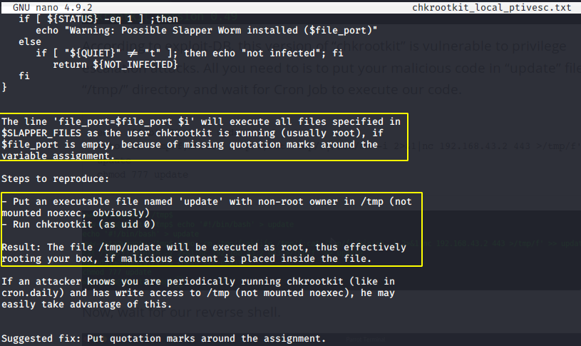

# SickOs1.2 Report

## Introduction

Welcome to the write up for the CTF challenge on SickOs machine.
Pease find the machine/box here - https://www.vulnhub.com/entry/sickos-12,144/

Download the mirror & extract the contents. Once done, please open the .ovf with virtual box.
start the kali machine on the virtual box

## Objective

SickOs1.2 CTF

# High-Level Summary

I was tasked with performing a CTF challenge on SickOs1.2 machine.

- 192.168.0.105 - Flag captured

# Methodologies

I utilized a widely adopted approach to performing penetration testing that is effective in testing & trying to capture the flag.
Below is a breakout of how I was able to identify and exploit the variety of this machine.

## Information Gathering

The information gathering portion of a penetration test focuses on identifying the scope of the penetration test.
During this penetration test, I was tasked with exploiting the exam network.
The specific IP address was:

**Victim IP**

- 192.168.0.105

### System IP: 192.168.0.12

#### Service Enumeration

The service enumeration portion of a penetration test focuses on gathering information about what services are alive on a system or systems.
This is valuable for an attacker as it provides detailed information on potential attack vectors into a system.
Understanding what applications are running on the system gives an attacker needed information before performing the actual penetration test.
In some cases, some ports may not be listed.

Server IP Address | Ports Open
------------------|----------------------------------------
192.168.0.105       | **TCP**: 22,80

**Accessing the webpage through port 80**

*viewing the source of the web page*

*Quite literally*

**Let's see if we could bruteforce for other directories**

*There's a directory /test/ ..hmm interesting*

**Looks like we've something - lighttpd 1.4.28**

*No luck with lighttpd*

**Ok, nothing so far. Let's try curl & see what methods are allowed -- woah! PUT is allowed here**

*Let's try uploading shell which takes commands*

*Let's see whether it's working by giving it a simple command like ifconfig which gives us it's mac & ip address -- it's working!*

*Uploading pythong reverse shell (found via pentestmonkey)*

*Setting up the listener*

**Acquiring the limited shell**

*So it is running on Ubuntu 12.04 & kernel 3.11.0-5 -- no luck finding the local priv escalation exploit fot his combination, let's check the services that are running*

#### Privilege Escalation

*We've a local privilage escalation exploit available for this very version of chkrootkit*

**Vulnerability Exploited:**

chkrootkit version 0.49 -- local privilage escalation

*The exploit says, we will have to create a file called update through non root user (in our case www-data), & chkrootkit runs it as a root through a no non-exec tmp folder.
   We have all of this tailor made for this situation -- tmp is not non-exec meaning, we can execute the scripts on /tmp directory. www-data is not root & chkrootkit verison is 0.49*

*Let's make sure cron runs chkrootkit*

*Now all we need to do is, create file update where the sudoers file is writable, add www-data as a sudoer with no password required & then turn the sudoers file back to just readable by owner & group.
chkrootkit runs this thinking it's run by root, adding the user we exploited - www-data to the sudoers list.*

**There we go!! we are root now!
&.. the flag we've all been talking about!**

